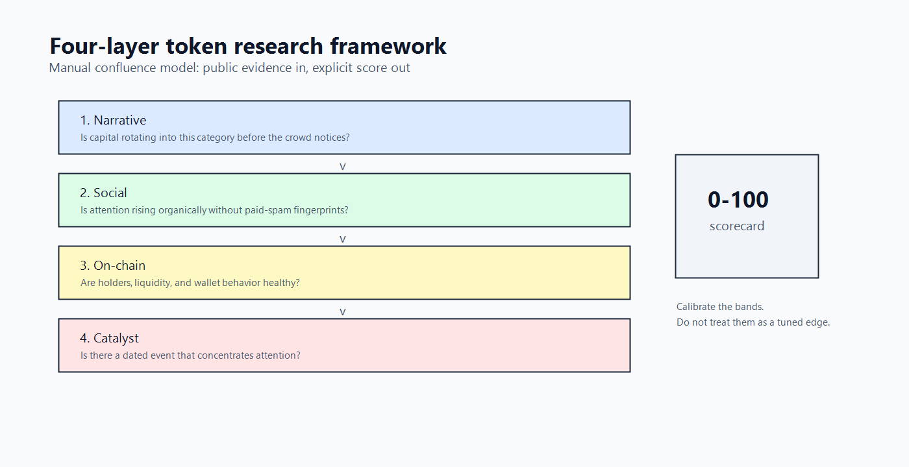
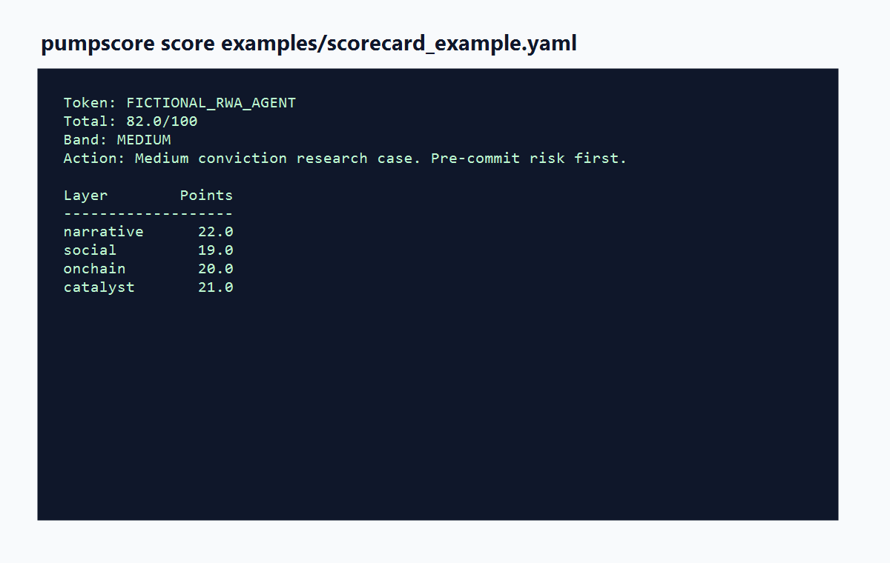

# Pump Research Framework

[](https://github.com/baronguyen001/pump-research-framework/actions)
[](LICENSE)

Why does a token 100x, and why do most not? This repo is a four-layer research
framework for narrative, social, on-chain, and catalyst evidence, distilled from
public case studies of winners and failures. It also ships `pumpscore`, a small
offline tool for scoring a token by hand.



This is research infrastructure, not alpha. It is not financial advice, not an
automated signal service, not a price-call list, and not a wallet list. The point
is to make a decision process explicit enough that you can challenge it.

## What is inside

- [framework/](framework/) explains the four layers, the lifecycle, strategy
  variants, and the limitations.
- [case_studies/](case_studies/) groups public market history into reusable
  patterns and counterexamples.
- [playbook/](playbook/) covers sizing, entries, exits, wallet hygiene, and
  anti-FOMO rules.
- [src/pumpscore/](src/pumpscore/) provides a deterministic local scorer with
  no network calls and no secrets.

## Four layers

| Layer | Question |
|---|---|
| Narrative | Is capital rotating into this category before the crowd notices? |
| Social | Is attention rising organically without looking like paid spam? |
| On-chain | Are holders, liquidity, and wallet behavior healthy? |
| Catalyst | Is there a dated event that can pull attention into the token? |

The default band table is intentionally simple:

| Score | Band | Default reading |
|---:|---|---|
| 0-40 | Ignore | Too little evidence. |
| 40-60 | Watch | Re-score later. |
| 60-75 | Small | Small risk budget only. |
| 75-90 | Medium | Stronger confluence, still capped. |
| 90-100 | High conviction | Strong case, never all-in. |

These bands are starting points for calibration. They are not a tuned edge.

## Quickstart

```bash
pip install pump-research-framework
pumpscore --help
```

From a checkout:

```bash
pip install -e ".[dev]"
pumpscore score examples/scorecard_example.yaml
pumpscore checklist examples/scorecard_example.yaml
pumpscore stage examples/scorecard_example.yaml
pumpscore size examples/scorecard_example.yaml --bankroll 10000
```

Example output is based on a fictional token:



Create a blank scorecard:

```bash
pumpscore template --out card.yaml
```

Then fill in the four layer scores, pattern checklist, red flags, and context
fields from your own research.

## New in v0.2

Three additive tools. The deterministic core stays offline and keyless; only the
narrative finder ever touches the network, and only when you ask it to.

### Current-narrative finder (opt-in, keyless)

`pumpscore narratives` ranks which categories are heating up right now, using the
free, read-only, public category endpoints from CoinGecko and DefiLlama. There is
no API key, no auth, and no scraping. It answers one question: "what narrative is
hot, so I know where to point the four-layer framework?" It is not a buy signal.

```bash
pip install "pump-research-framework[net]"   # optional network extra
pumpscore narratives --source coingecko --top 15
pumpscore narratives --source defillama --top 15
```

If you are offline, or the public endpoint is down, it prints a clear message and
exits instead of crashing. The deterministic core never imports this module.

### Per-strategy backtest stubs

`pumpscore backtest` reads a CSV of public, after-the-fact case outcomes and prints
hit-rate, median multiple, and a survivorship-adjusted hit-rate for each of the
A/B/C/D/E strategy modes, alongside explicit caveats. These are honest stubs, not
an edge: the inputs are hand-collected and survivorship-biased, and the tool says
so out loud.

```bash
pumpscore backtest examples/cases_example.csv
```

The shipped `examples/cases_example.csv` contains clearly fictional rows. Bring
your own public data with the columns
`strategy,token,entry_date,multiple,flagged_by_framework,survived`.

### HTML scorecard

`pumpscore report` renders a single self-contained HTML page from a scorecard:
four-layer bars, total and band, checklist verdict, lifecycle stage, and the
educational sizing plan. Pure string templating, no JavaScript, no external
assets.

```bash
pumpscore report examples/scorecard_example.yaml --out scorecard.html
pumpscore score examples/scorecard_example.yaml --html scorecard.html
```

## The honest part

Most "alpha" writeups stop at the winners. This repo keeps the uncomfortable
pieces: survivorship bias, hindsight bias, memecoins that move before any
framework can catch them, and the 5/30 anti-FOMO rule that can also kill fast
runners. Read [limitations.md](framework/limitations.md) before using any score.

## Public case studies

The case-study library includes public examples such as SHIB, PEPE, WIF, BONK,
SOL, JUP, HYPE, VIRTUAL, and AI16Z, plus failure or dump cases such as ICP,
LayerZero and EigenLayer airdrop pressure, and the 2025 AI-agent drawdown. All
figures are approximate and sourced from public reports or market history at the
time of writing.

## Pair it with the portfolio

- [wallet-cluster-detector](https://github.com/baronguyen001/wallet-cluster-detector):
  the on-chain layer implemented as an open-source case study.
- [confluence-scanner](https://github.com/baronguyen001/confluence-scanner):
  the multi-factor scoring pattern for market signals.
- [Trawlkit](https://github.com/baronguyen001/Trawlkit): the private paid kit
  for building a live scrape-to-AI-to-alert workflow.
- [ai-automation-skills](https://github.com/baronguyen001/ai-automation-skills):
  free automation skills that feed the same funnel.

## Disclaimer

Crypto assets are high risk. This repo is educational software and public
research only. Backtests, case studies, and score bands do not predict future
returns. Bring your own research, risk management, jurisdictional advice, and
tax records.

PyPI publish status: pending until a release token is available.
