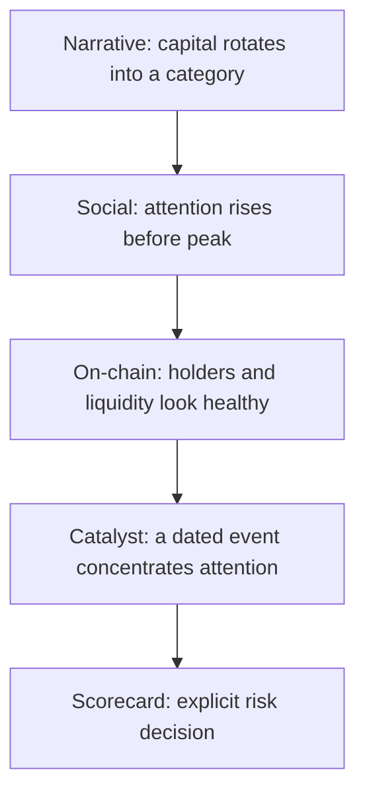

# Framework

The framework starts from one assumption: no single indicator is enough. Large
token rallies tend to need several layers firing together:

The scorecard gives each layer 0 to 25 points. Missing evidence should score 0,
not "maybe." The default bands are illustrative:

| Total | Band | Default reading |
|---:|---|---|
| 0-40 | Ignore | Too little evidence. |
| 40-60 | Watch | Worth tracking, not enough for action. |
| 60-75 | Small | Research case is plausible but fragile. |
| 75-90 | Medium | Multiple layers agree; cap size anyway. |
| 90-100 | High conviction | Rare, still not permission to go all-in. |

The limitation is obvious: a simple score can hide strategy differences. A
pre-listing CEX play, a memecoin micro-bet, and a narrative rotation basket do
not have the same base rate. Read `strategies.md` and `limitations.md` before
using the total as anything more than a research summary.

Funnel note: if you want to automate collection across the four layers, use this
repo as the public thinking model and Trawlkit as the private bot scaffold.
