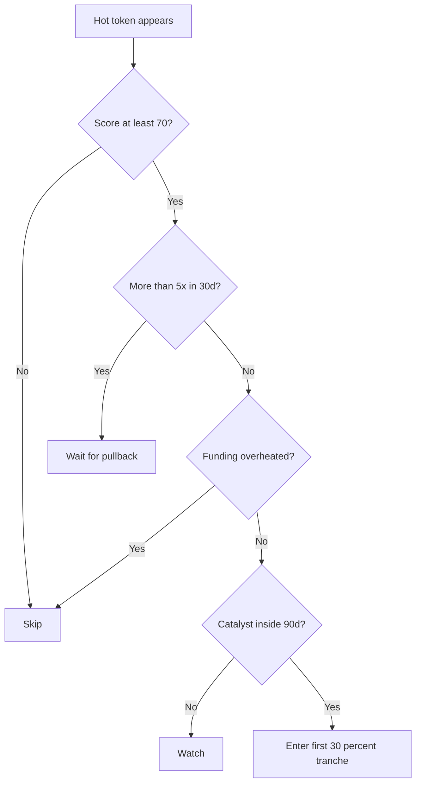

# Lifecycle

The goal is not to be earliest. The goal is to avoid being late while the
evidence is still improving.

| Stage | Observable signals | Default action |
|---|---|---|
| Seed | Technical work, low liquidity, little market structure | Watch only |
| Whisper | Smart wallets, mid-tier accounts, early liquidity | Research deeply |
| Public awareness | Category mindshare rises, Google Trends starts moving | Smaller entries only |
| Mainstream | large outlets, CEX volume, tier-1 listings | Take profit, avoid new chase |
| Euphoria | leverage, daily spikes, "this time different" language | Reduce risk |
| Collapse | down 70 to 90 percent, social blame, liquidity exits | Stand aside |

## Top-down cadence

| Layer | Cadence | Examples |
|---|---|---|
| Macro | Weekly | BTC dominance, stablecoin supply, ETF flows, chain TVL |
| Meso | Every few days | category returns, mindshare, prediction markets |
| Micro | Realtime or daily | holder growth, liquidity, volume, social mentions |

## Goldilocks gate

The default gate requires five checks:

1. Macro confirm: narrative layer is at least 18/25.
2. Meso confirm: catalyst layer is at least 18/25.
3. Micro confirm: social and on-chain layers are both at least 18/25.
4. Not too hot: price has not moved more than 5x in about 30 days and funding is
   not overheated.
5. Has catalyst: a public event is inside 90 days.

These thresholds are deliberately blunt. Calibrate them against your own logs.

## The 5/30 rule

If a token has already moved more than 5x in about 30 days, do not open a full
position. Wait for a pullback, use smaller size, or look for a lagging token in
the same category.

This rule protects against FOMO. It also misses outliers. YFI, SHIB, PEPE, and
WIF-style moves can run through every anti-FOMO filter. See `limitations.md`.

## Pyramid scaling

| Tranche | Size | Confirmation |
|---:|---:|---|
| 1 | 30 percent | score clears the gate and thesis is written |
| 2 | 30 percent | price or volume confirms |
| 3 | 25 percent | catalyst becomes official |
| 4 | 15 percent | breakout confirms and invalidation still holds |

## Decision tree

